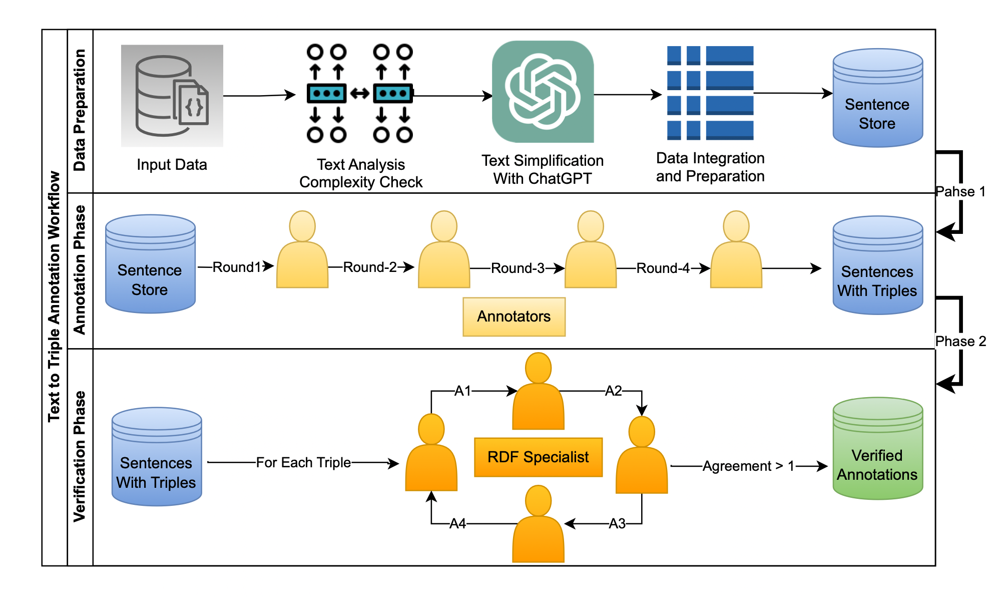
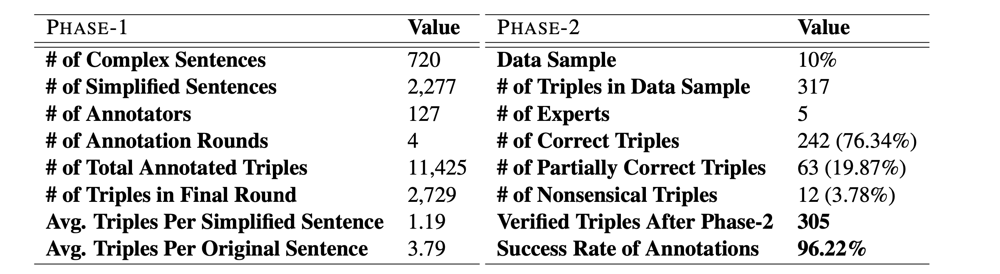
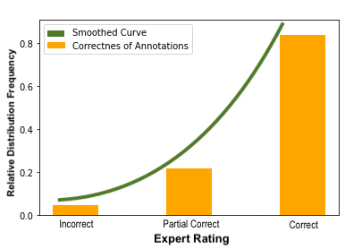
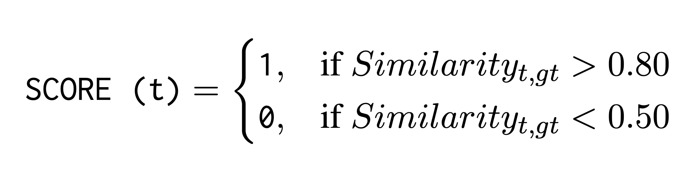
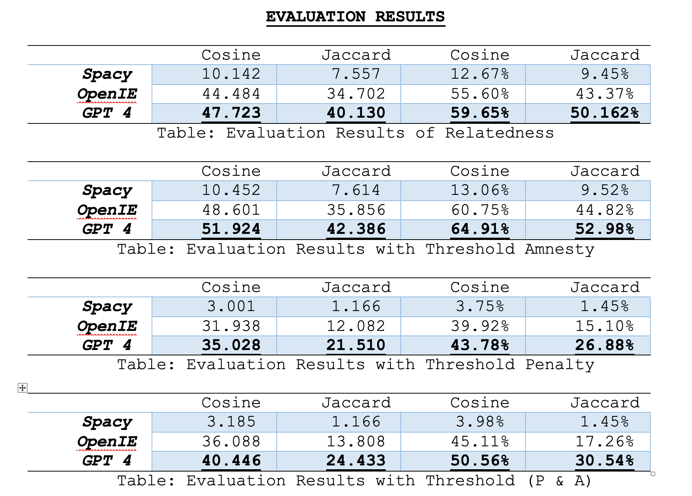
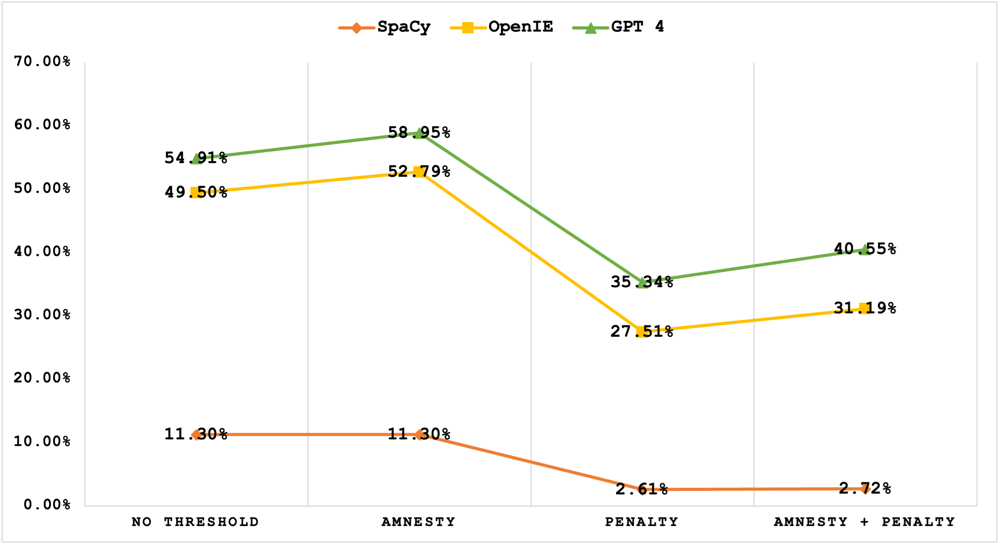

# Tiny But Mighty — A Benchmark Dataset for Triple Extraction From Unstructured Text

This work introduces a novel dataset specifically designed to evaluate KG construction techniques from unstructured text. Our dataset consists of a diverse collection of compound and complex sentences meticulously annotated by human annotators with potential triples (subject, verb, object). The annotations underwent further scrutiny by expert ontologists to ensure accuracy and consistency. For evaluation purposes, the proposed F-measure criterion offers a robust approach to quantify the relatedness and assess the alignment between extracted triples and the ground-truth triples, providing a valuable tool for evaluating the performance of triple extraction systems.  

<h2 align="center">
  Flow of Annotation Process:
  
</h2>

## Requirements
* Python 3.8.
* Stanford OpenIE.
* SpaCy.
* GPT4.
  
## Dataset Statistics
<h2 align="center">
  Statistics of the Annotated Dataset in Each Phase
  
</h2>

<h2 align="center">
  Verification Phase: Relative Distribution of Triple Correctness
  
</h2>

## Evaluation
- Implemented Tools/Libraries:  
	1. SpaCy (SVO) Extraction Model.  
	2. Stanford OpenIE Triple Extractor.  
	3. GPT4 via ChatGPT Prompt.  
  
- Evaluation Criteria:  
	1. Triple Mentions' Vector.  
	2. Vector Similarity (Ground Truth VS Extracted Triple).  
  
- Similarity Measures:  
	1. Cosine Similarity.  
	2. Jaccard Similarity.  
	3. Fuzzy Similarity.  
  
- Evaluation Framework:  
	1. Removing Similar Triples from Tools’ Output.  
	2. Calculating Each triple’s similarity score with GT Triples and keeping the highest similarity.  

### Thresholds

<h2 align="center">
  Applied Threshold on Triple Similarity Measure
  
</h2>

### Performance
<h2 align="center">
  The Performance of System With Amnesty and Penalty Thresholds
  
</h2>

<h2 align="center">
  Graphical Representation of Performance
  
</h2>

<h2 align="center">
  Average and Normalized Performance
  
</h2>

## How to test
- The code folder contains the relevant code files.

## License
This dataset is available to the public under the CreativeCommons license. This license grants users comprehensive permissions, including the freedom to utilize, modify, and create derivative works based on the dataset. Users are also permitted to distribute and share the dataset with the condition that they include this license statement in their distributions. It is important to note that this dataset is provided "as is" without any warranty, and the authors or contribu- tors of the dataset disclaim any liability for dam- ages or claims resulting from its use or distribution.

## Citation

If you use this dataset or code in your research, please cite our paper:

```bibtex
@inproceedings{salman-2024-tinybutmighty,
    title = "Tiny But Mighty: A Crowdsourced Benchmark Dataset for Triple Extraction from Unstructured Text",
    author = "Salman, Muhammad  and
      Haller, Armin  and
      Rodriguez Mendez, Sergio J.  and
      Naseem, Usman",
    booktitle = "Proceedings of the 20th Joint ACL - ISO Workshop on Interoperable Semantic Annotation @ LREC-COLING 2024",
    month = may,
    year = "2024",
    address = "Torino, Italia",
    publisher = "ELRA and ICCL",
    url = "https://aclanthology.org/2024.isa-1.10",
    pages = "71--81",
}
